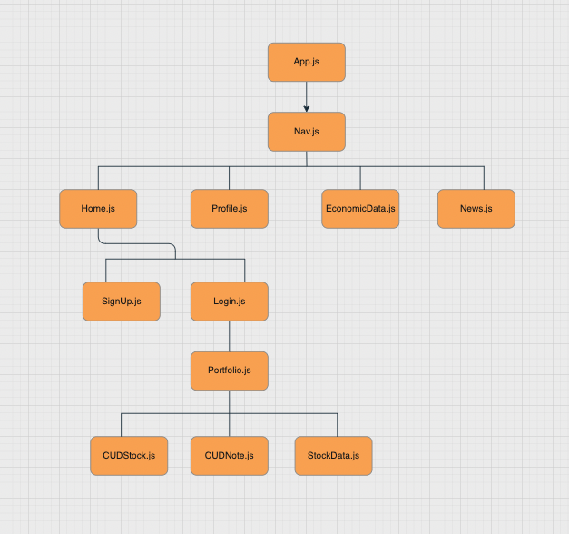
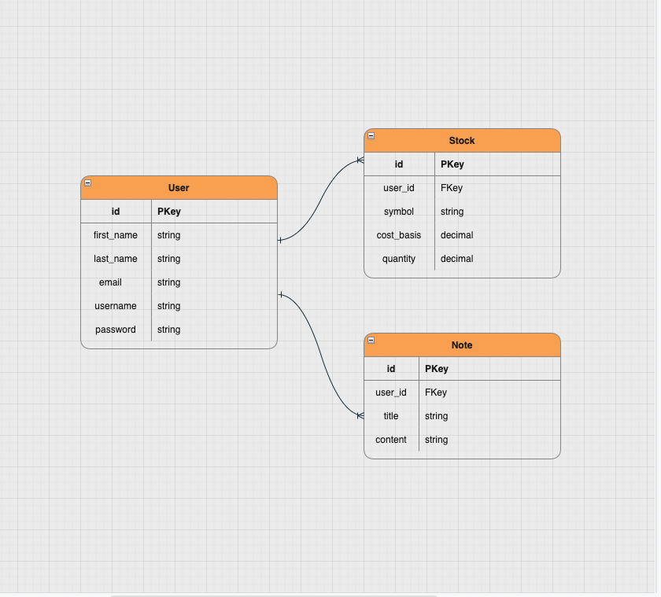

# Stox_TCKR_Backend

## 9/1/2022

### By:  [Jeff Fraley](https://github.com/frank-booth)

---

### _Description_

#### A website for individuals to maintain and track stock portfolios. The site will also contain economic data from a 3rd party api.

---

### _Languages_

- Postgresql/Sequelize or Postgresql/Django
- Python (if Django is used)
- Express
- React
- Node.js

---

### _Trello Board_

---
### _Component Heirarchy Diagram_

---
### _Entity Relationship Diagram (ERD)_

---
### _Wireframes_

---
### _Future Updates_

---
### _Post-MVP_

---
### _Credits_

#### [Alpha Vantage API](https://www.alphavantage.co/)

